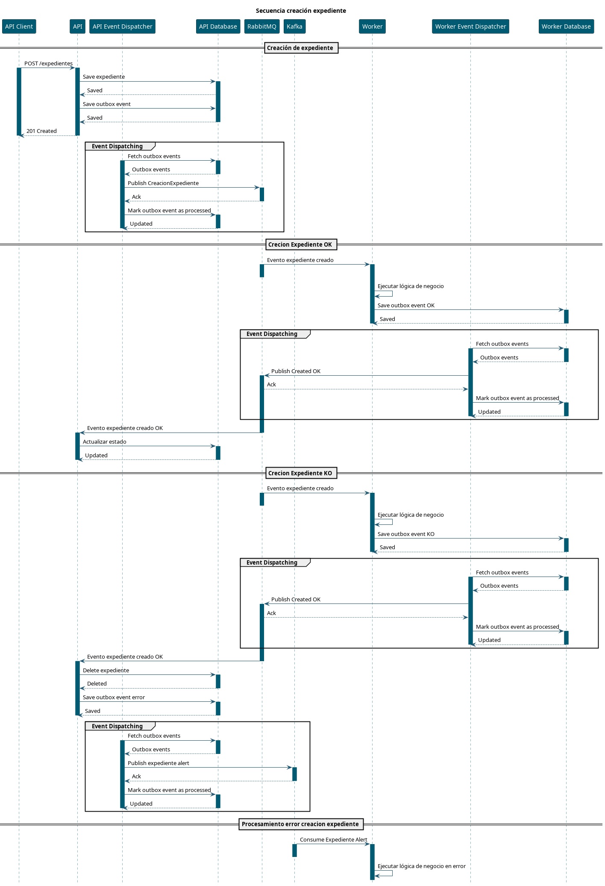

# Sample Jakarta Basic SAGA

Ejemplo de implementación SAGA coreografiada utilizando Jakarta EE sin dependencias adicionales.

La aplicación consta de dos microservicios:

* _sample-app_: aplicación principal que expone una API REST para gestionar expedientes y generar alertas.
* _sample-worker_: worker que consume eventos para procesar expedientes.

Ambos microservicios están basados en WildFly usando el formato bootable jar lo que permite ejecutarlos sin necesidad de un servidor de aplicaciones externo.

Estos microservicios utilizan las librerías compartidas:

* _jakarta-stream-binder_: librería de abstracción para la integración con sistemas de mensajería (Kafka y RabbitMQ en este ejemplo).
* _jakarta-cqts_: implementación básica de CQRS para integrar el tratamiento de eventos.

Adicionalmente se utilizan las dependencias:

* _mapstruct_: para el mapeo entre entidades y DTOs.
* _lombok_: para reducir el código boilerplate.
* _jackson_: para la serialización y deserialización de objetos JSON.

## Flujo de la aplicación

El flujo de la aplicación es el siguiente:

## Ejecución

Compilaremos usando:

[source,bash]
----
mvn clean install -DskipTests
----

En primer lugar levantaremos RabbitMQ y Kafka utilizando Docker compose:

[source,bash]
----
docker compose up -d
----

### API

Iniciar la API REST:

[source,bash]
----
java -Djboss.http.port=8080 \
  -Djboss.management.http.port=9990 -jar \
  sample-app/target/sample-app-bootable.jar
----

### Worker

Inicial el worker:

[source,bash]
----
java -Djboss.http.port=8081 \
  -Djboss.management.http.port=9991 \
  -jar sample-worker/target/sample-worker-bootable.jar
----

### Pruebas

Para crear un expediente:

[source,bash]
----
curl -v -X POST http://127.0.0.1:8080/sample-app/expedientes \
  -H "Content-Type: application/json" \
  -d '{"nombre": "John", "apellido1": "Doe", "apellido2": "Smith", "codigo": "EXP123"}'
----

TIP: Para forzar un error en la creación de expediente que fuerce el proceso de compensación
podemos establecer _"codigo": "ERROR"_ en el payload.

Para consultar los expedientes creados:

[source,bash]
----
curl -v http://127.0.0.1:8080/sample-app/expedientes
----

## ImplementaciónDe este modo la estructura interna de la aplicación hace que tengas separad

### Binder

Se ha optado por una configuración de Binder basada en anotaciones manteniendo la independencia de los
consumidores y productores respecto a la infraestructura de mensajería.

La estrategia de binding se ha basdado en asociar a cada consumidor/productor un canal específico, lo
que permite una mayor flexibilidad a la hora de configurar la infraestructura de mensajería.

Para el consumo y el envio de mensajes se han definido las interfaces:

[source,java]
----
public interface MessageConsumer<T> extends AutoCloseable {

    CompletionStage<Message<T>> receive();

    void subscribe(Consumer<Message<T>> handler);
}
----

[source,java]
----
public interface MessageProducer<T> extends AutoCloseable {

    CompletionStage<SendResult> send(T payload);

    CompletionStage<SendResult> send(Message<T> message);

}
----

Esto permitirá definir los consumidores y productores del siguiente modo:

[source,java]
----
    @Inject
    @Channel("creacion-expediente")
    private MessageProducer<Expediente> eventProducer;

    @Inject
    @Channel("creacion-expediente-ko")
    private MessageConsumer<ResultadoCreacionExpedienteDto> consumer;
----

Posteriormente en la configuración del binder asociaremos cada canal a un productor o consumidor concreto:

[source,properties]
----
messaging.channels.rabbit.host=localhost
messaging.channels.rabbit.port=5672
messaging.channels.rabbit.username=admin
messaging.channels.rabbit.password=admin
messaging.channels.kafka.bootstrap.servers=sample-kafka-broker:9092

# Productores
messaging.channels.creacion-expediente.type=rabbitmq
messaging.channels.creacion-expediente.exchange=expedientes
messaging.channels.creacion-expediente.routing-key=creacion

messaging.channels.creacion-expediente-alerta.type=kafka
messaging.channels.creacion-expediente-alerta.topic=creacion-expediente-alerta-topic

# Consumidores
messaging.channels.creacion-expediente-ok.type=rabbitmq
messaging.channels.creacion-expediente-ok.queue=creacion-expediente-ok-cola

messaging.channels.creacion-expediente-ko.type=rabbitmq
messaging.channels.creacion-expediente-ko.queue=creacion-expediente-ko-cola
----

### CQRS

Para la gestión de los expedientes se ha optado por una arquitectura CQRS, con un repositorio JPA para la parte de consulta y un repositorio basado en eventos para la parte de comandos.

Esta es una implementación mínima de CQRS, sin separación de modelos ni bases de datos, pero que permite ilustrar el concepto de forma sencilla.

De este modo en el ejemplo podemos usar el concepto de _interfaces_ de arquitectura hexagonal
para definir todos los métodos en los que la aplicación recibe peticiones externas, ya sean
REST o eventos, en esa capa transformar la petición a un comando o una consulta y ejecutarla
en un bus para tener desacoplada la lógica de negocio del transporte de los mensajes.

De este modo aislamos la lógica de negocio de la infraestructura de mensajería y de la API REST, lo que facilita el mantenimiento y la evolución de la aplicación. Además haremos que
el código de los controladores de APIs sean equivalentes a los controladores de eventos ya que
su única responsabilidad será la de transformar los objetos de entrada y crear los comandos o queries correspondientes.

## TODO

* Implementación de gestión de errores en los binders con politicas de reintentos y tratamiento customizado de excepciones.
* Registro automático de exchange/queue y topics para no hacerlo manualmente.
* Reconexión automática en caso de fallo de la conexión con la infraestructura de mensajería.
* Configuracion sobre el tipo de serialización a utilizar (JSON, Avro, Protobuf, etc).
* Consideraciones de aplicar patron Outbox y persistir los eventos antes del envío al broker.

## Notas

### Consideraciones sobre el patrón Outbox

Si bien no es necesario para implementar un patrón SAGA donde simplemente podemos enviar los mensajes al broker, aplicar este patrón tiene varias ventajas:

* Garantiza la consistencia entre la base de datos y el broker de mensajes, ya que los eventos se almacenan en la base de datos antes de ser enviados al broker.
* Permite implementar políticas de reintentos y gestión de errores de forma más sencilla, ya que los eventos se pueden marcar como enviados o con error en la base de datos.
* Facilita la auditoría y el seguimiento de los eventos, ya que se pueden almacenar metadatos adicionales en la base de datos junto con el evento.

Este caso último de auditoría es relevante ya que si al final tenemos N entidades del dominio
que funcionan como una máquina de estados, para saber el estado de todas las transacciones en curso es necesario una consulta para cada una de las entidades.
Aplicando el patrón Outbox podemos almacenar toda la información relevante de cada evento en la base de datos y así poder consultar el estado de todas las transacciones con una única consulta a la base de datos.

### Consolas de administración de RabbitMQ y Kafka

* RabbiMQ Admin Console: http://127.0.0.1:15672/
* Kafka UI Admin Console: http://127.0.0.1:8091/
